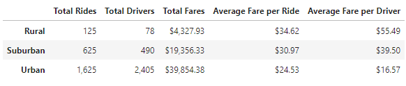
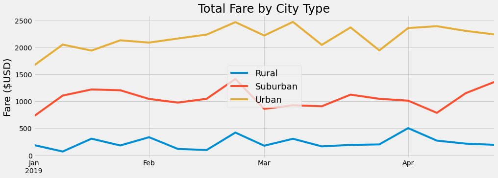

# PyBer Ride-Sharing Data Analysis

## Overview of the analysis: 
The purpose of the analysis is to understand the differences in PyBer services availability and affordability across different city types -  Urban, Suburban, and Rural - with the ultimate goal of improving access to ride-sharing services and increasing affordability for under-served neighborhoods.

## Results: 

There are several important insights revealed by the analysis. Let's take a look at the summary table of  ride sharing data by city type:

From this summary, we can see that there are significant differences in the availability and affordability of the PyBer services across different types of cities. 

### Total Rides by City Type
The total number of rides is significantly higher in urban cities than in suburban cities (5x higher) and rural cities (13x higher).

### Driver Representation by City Type
The number of drivers operating in urban cities is 5x greater than the number of drivers in suburban cities and 31x greater than the number of drivers in rural areas. 

### Average Fare per Ride by City Type
The average fare per ride in rural areas is 1.4x higher than the average fare in urban cities and the average fare in suburban areas is 1.3x higher than in urban areas.

### Total Fares by City Type
Regardless of the higher average fares in suburban and rural areas, the total fares in these areas are lagging behind the urban areas due to low ride counts. Here is a break down of the total fares:
- Rural: ~$4K
- Suburban: ~$19K
- Urban: ~$40K

Thus, total fares in urban cities are 10x higher than in rural cities and 2.1x higher than in suburban cities.

### Total Fares by City Type from Jan 2019 to April 2019

From the chart below we can see that the total fares in rural and suburban areas stayed consistently lower than the fares in urban areas and the total fares gap has not decreased during the evaluation time period of January 2019 - April 2019:

## Summary: 

Based on the results of the analysis there are missed opportunities for PyBer expansion into the rural and suburban communities. 
This is driven both by the lack of driver representation and by the lack of service affordability in these areas.  To help address these concerns, I suggest the following initiatives:

1. Target rural and suburban communities when advertising PyBer ride sharing services and driver opportunities with PyBer to increase public awareness and interest.
2. Create pay incentives for drivers in rural and suburban areas to increase driver representation.
3. Introduce promotional ride offers for customers in rural and suburban communities to increase service adoption.
